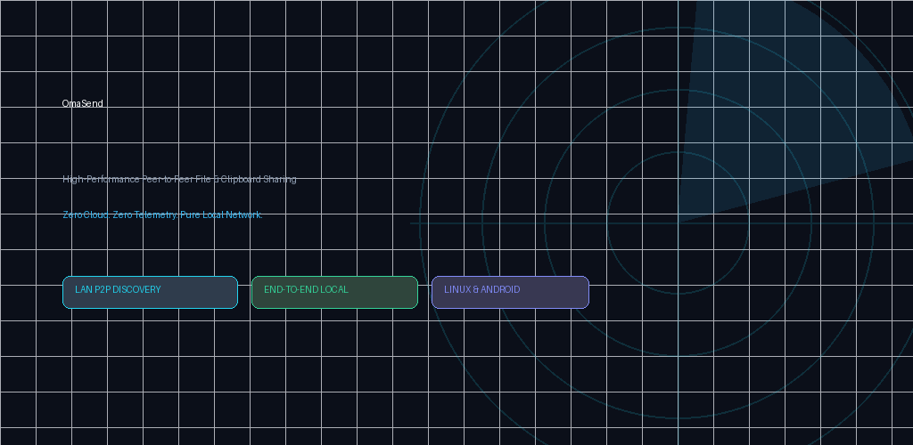
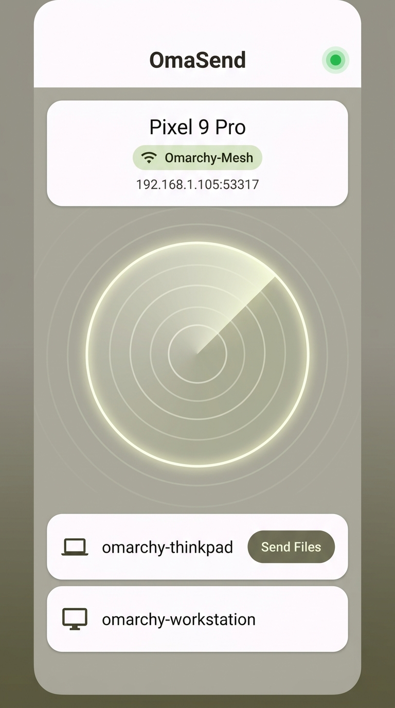
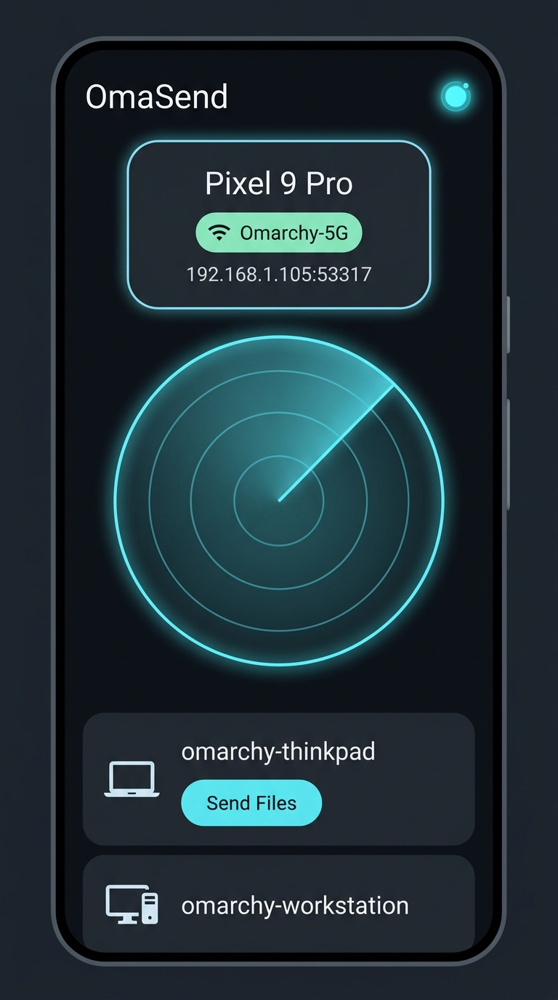

# 📱 OmaSend for Android

<p align="center">
  
</p>

<p align="center">
  <a href="https://play.google.com/apps/testing/io.omarchy.omasend"></a>
  <a href="https://groups.google.com/g/omasend-testers"></a>
  <a href="https://github.com/ozdil/omarchy-omasend"></a>
  <a href="LICENSE"></a>
</p>

> **High-performance, privacy-first local peer-to-peer file transfer, system share-sheet integration, and real-time Wayland clipboard bridge between Android and Omarchy Linux.**

---

## 🛡️ Official Google Play Closed Beta (Testing Program)

OmaSend for Android is distributed officially via **Google Play** with verified SHA-256 application signing and **Play Protect** security scanning.

### 🚀 How to Install & Join the Beta (3 Simple Steps):

1. **Join the Tester Community (Google Group):**  
   👉 **[Join OmaSend Testers Google Group](https://groups.google.com/g/omasend-testers)**  
   *(Click "Join group" with the same Google account you use on your Android phone).*

2. **Opt-in to the Testing Program (Google Play Web):**  
   👉 **[Opt-in on Google Play](https://play.google.com/apps/testing/io.omarchy.omasend)**  
   *(Click "Become a tester" / "Test kullanıcısı ol").*

3. **Install from Google Play Store:**  
   👉 **[Download OmaSend on Google Play](https://play.google.com/store/apps/details?id=io.omarchy.omasend)**  
   *(Open the link directly on your Android device to install via Play Store).*

> 💡 **Troubleshooting Tip:** If you see *"Item not found"* or *"App not available"*, verify that you have joined the [Google Group](https://groups.google.com/g/omasend-testers) using the **exact same Google account** that is logged into your phone's Google Play Store.

---

## 📸 Screenshots

<p align="center">
  
  &nbsp;&nbsp;
  
</p>

---

## ✨ Features & Capabilities

- 📲 **Native Android Share Sheet Integration:** Share photos, videos, audio, documents, and archives directly from Gallery, WhatsApp, Camera, or Files with 1 tap.
- 📋 **Live Bi-Directional Clipboard Bridge:** Instantly copy text or code from your PC's Wayland desktop clipboard into Android, or push Android text directly to your Linux desktop clipboard with instant notifications.
- ⚡ **Zero Cloud & Absolute Privacy:** Operates strictly over local Wi-Fi / Ethernet sockets. Zero telemetry, zero external cloud servers, zero analytics, and zero tracking.
- 🔍 **Instant UDP Discovery:** Automatic device discovery on port `53317` without tedious manual IP typing or Bluetooth pairing friction.
- 🎨 **Modern AMOLED Jetpack Compose UI:** Built with Material 3, Cyber Dark AMOLED aesthetic, and fluid reactive state management.
- 🔒 **End-to-End Cryptographic Security:** Zero-Trust ephemeral tokens, PIN authentication, and SHA-256 integrity verification.

---

## 🖥️ Omarchy Linux Desktop Integration

OmaSend for Android is designed to pair seamlessly with the official Omarchy Linux desktop plugin:

- **Desktop Plugin Repository:** [ozdil/omarchy-omasend](https://github.com/ozdil/omarchy-omasend)
- **Engine Protocol:** Compatible with OmaSend Linux Engine (`omasend-engine`) on port `53317`.

---

## 🛠️ Build from Source

```bash
# Clone the repository
git clone https://github.com/ozdil/omasend-android.git
cd omasend-android

# Build Debug APK
./gradlew assembleDebug

# Install directly to connected phone via ADB
adb install -r app/build/outputs/apk/debug/app-debug.apk
```

---

## 📄 License

This project is licensed under the **MIT License**. See [LICENSE](LICENSE) for details.
