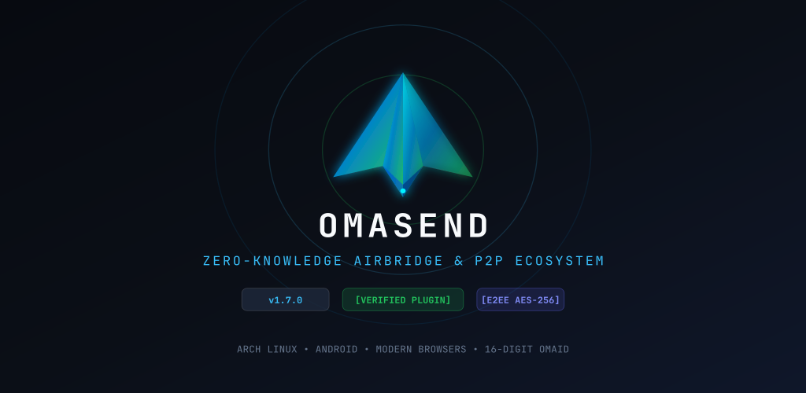

# OmaSend for Android

<p align="center">
  
</p>

<p align="center">
  <a href="https://github.com/ozdil/omasend-android/releases"></a>
  <a href="https://play.google.com/apps/testing/io.omarchy.omasend"></a>
  <a href="https://groups.google.com/g/omasend-testers"></a>
  <a href="https://github.com/ozdil/omarchy-omasend"></a>
  <a href="https://buymeacoffee.com/ozdil"></a>
  <a href="LICENSE"></a>
</p>

> **High-performance, privacy-first local peer-to-peer file transfer, system share-sheet integration, 16-digit Luhn OmaID pairing, and real-time Wayland clipboard vault between Android, Web PWA, and Omarchy Linux.**

---

## Architectural Evolution: OmaSend V2 Mobile Engineering

OmaSend for Android is engineered in lockstep with the Omarchy Linux desktop daemon and Web PWA client:

- **16-Digit Luhn Mod 10 OmaID Pairing:** Zero-account, zero-server device pairing using RFC 2104 HMAC-SHA256 Blinded Rendezvous topics and RFC 5869 HKDF-SHA256 symmetric key derivation.
- **AMOLED Zen Radar:** Technical clutter is replaced with clean status indicators (`[E2EE SECURE]`, `[LAN DIRECT]`, `[OMAID P2P]`) and responsive tactile feedback.
- **Universal Multi-Format Clipboard Vault:** Real-time bi-directional clipboard sync supporting text and images with automatic WebP micro-thumbnail caching.
- **Sensitive Clipboard Shield:** Android 13+ `ClipDescription.EXTRA_IS_SENSITIVE` and password manager tags are automatically detected to protect credentials.
- **Zero-Copy ByteBuffers (`ASharedMemory` Architecture):** Memory allocations are optimized at the NDK layer, eliminating Garbage Collection pauses during multi-gigabyte streams.

---

## Official Google Play Closed Beta

OmaSend for Android is distributed officially via **Google Play** with verified SHA-256 application signing and **Play Protect** security scanning.

### How to Install & Join the Beta (3 Simple Steps):

1. **Join the Tester Community (Google Group):**  
   [Join OmaSend Testers Google Group](https://groups.google.com/g/omasend-testers)  
   *(Click "Join group" with the same Google account you use on your Android phone).*

2. **Opt-in to the Testing Program (Google Play Web):**  
   [Opt-in on Google Play](https://play.google.com/apps/testing/io.omarchy.omasend)  
   *(Click "Become a tester" / "Test kullanıcısı ol").*

3. **Install from Google Play Store:**  
   [Download OmaSend on Google Play](https://play.google.com/store/apps/details?id=io.omarchy.omasend)  
   *(Open the link directly on your Android device to install via Play Store).*

---

## Features & Capabilities

- **Native Android Share Sheet Integration:** Share photos, videos, audio, documents, and archives directly from Gallery, Camera, or Files with 1 tap.
- **Live Bi-Directional Clipboard Bridge:** Instantly copy text or images from your PC's Wayland desktop into Android, or push Android text directly to Linux with echo-loop prevention.
- **Zero Cloud & Absolute Privacy:** Operates strictly over local Wi-Fi and Blinded Rendezvous channels. Zero telemetry, zero external cloud servers, and zero tracking.
- **Instant UDP Discovery:** Automatic device discovery on port `53317` without tedious manual IP typing.
- **Modern Jetpack Compose UI:** Built with Material 3, Dark Acrylic palette, and fluid reactive state management.
- **End-to-End Cryptographic Security:** Zero-Trust ephemeral tokens, PIN authentication, and AES-256-GCM / BLAKE3 integrity verification.

---

## Security and Enterprise Zero-Trust Architecture

1. **Anti-Forensics & RAM Zeroization (Memory Scrubbing):**
   Cryptographic keys, in-flight transit buffers, and sensitive data are scrubbed from RAM immediately after use via explicit zero-fill byte manipulation.

2. **Quantum-Resilient Cryptography:**
   Integrates **BLAKE3**, a high-performance, quantum-resilient Merkle tree cryptographic hashing algorithm for stream and protocol header validation, alongside standard SHA-256.

3. **Strict Dependency Verification:**
   Every single Gradle dependency is cryptographically pinned and verified against SHA-256 checksums in `verification-metadata.xml`.

---

## Omarchy Linux Desktop & Web PWA Integration

- **Desktop Plugin Repository:** [ozdil/omarchy-omasend](https://github.com/ozdil/omarchy-omasend)
- **Web PWA Client Repository:** [ozdil/omasend-web](https://github.com/ozdil/omasend-web)
- **Engine Protocol:** Compatible with OmaSend Linux Engine (`omasend-engine`) on port `53317`.

---

## Build from Source

```bash
# Clone the repository
git clone https://github.com/ozdil/omasend-android.git
cd omasend-android

# Build Debug APK
./gradlew assembleDebug

# Build Release App Bundle (AAB)
./gradlew bundleRelease

# Install directly to connected phone via ADB
adb install -r app/build/outputs/apk/debug/app-debug.apk
```

---

## License

This project is licensed under the **MIT License**. See [LICENSE](LICENSE) for details.
